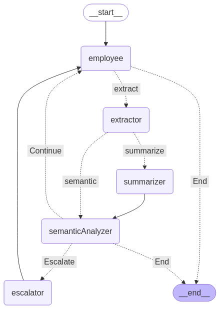

# Customer Chatbot

This repo is an implementation for a chatbot that helps customers for arbitrary platforms. Here is the architecture of the multi-agent system:

The main nodes are 

* Employee: He is responsible for receiving the enquiries of the customers.
* extractor: He is responsible for extracting the information of the user to be used across different sessions.
* Summariser: He is responsible for making the length of the messages less than 25 by summarising the conversation to be used further in the session.
* semanticAnalyzer: He is responsible for receiving the feedback of the customer and then deciding if the issue is resolved or not.
* escalator: He is responsible for summarising the issue and then escalating it to a human agent to resolve it if the chatbot could not resolve the concern during 3 turns.

## To Do
1. Improve the efficiency of the multi-agent system.
2. Improve the performance of the RAG class. 
3. Integrate the RAG class into the system.